# TP2  PhpService – Microservice PHP et Java avec Docker

---

## Captures d’écran du microservice

---

### 1. Test du service PHP dans le navigateur
Affichage de la réponse à `http://localhost:8081`.

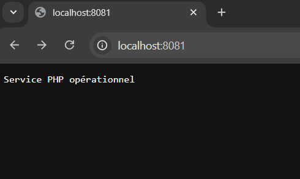

---

### 2. Test du service PHP pour la route adresse dans le navigateur
Affichage de la réponse à `http://localhost:8081/customers/Johary/adress`.

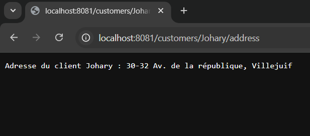

---

### 3. Test du service Java dans le navigateur
Affichage de la réponse à `http://localhost:8080`.


---

### 4. Test du service Java pour la route Bonjour dans le navigateur
Affichage de la réponse à `http://localhost:8080/bonjour`.

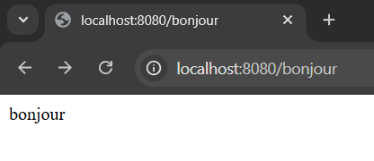

---

### 5. Test du service Java pour la route adresse dans le navigateur
Affichage de la réponse à `http://localhost:8080/customer/Johary`.


---

# TP3 Déploiement d’un microservice PHP dans Kubernetes (Minikube)

# Partie 1 : Créer un déploiement Kubernetes à partir d'une image Docker

# Après installation de minikube lancer minikube

```bash
minikube start
```

# Vérification des pods

```bash
kubectl get pods

```
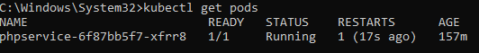


# Description du pods

```bash
kubectl describe pods
```

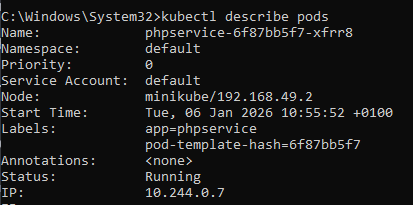


# Entrer dans le conteneur

```bash
kubectl exec -it phpservice-xxxxx -- /bin/bash
ls
exit
```
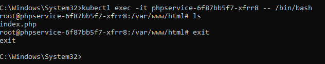


# Exposition du service

```bash
kubectl expose deployment phpservice --type=NodePort --port=80
```
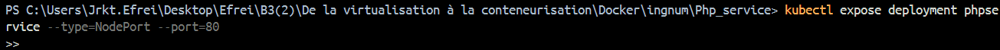


# Exposition du service

```bash
minikube service phpservice --url
```
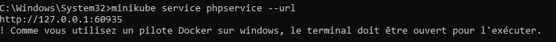


# TEST du service

```bash
http://127.0.0.1:xxxxx
```

```bash
http://127.0.0.1:xxxxx/customers/Johary/address
```
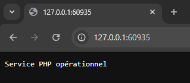

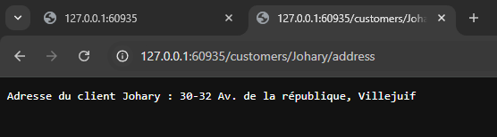


# Partie 2 : Scaling 

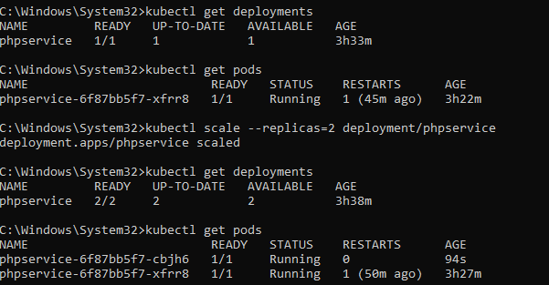

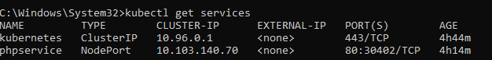


# Partie 3 : Création d'un service de type LoadBalancer

# creation du service LoadBalncer


# Récupérer l’URL Minikube

```bash
minikube service phpservice --url
```
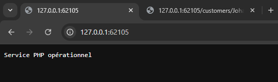

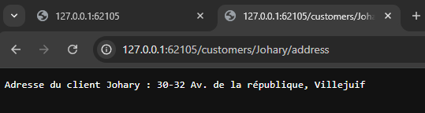


# Partie 4 : Rolling Updates

## modification du code dans index.php

```bash
echo "Service PHP opérationnel — VERSION 2";
```

# Rebuild l’image version 2

```bash
docker build -t johary94/phpservice:2 .
```
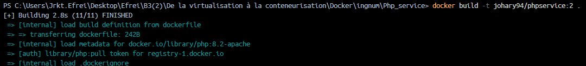

# Push sur Docker Hub

```bash
docker push johary94/phpservice:2
```
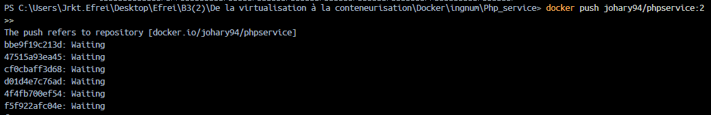

# Rolling update dans Kubernetes

```bash
kubectl set image deployment/phpservice phpservice=johary94/phpservice:2
kubectl rollout status deployment/phpservice
```

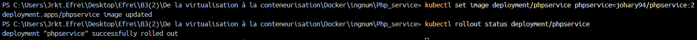

# TEST dans le navigateur 

```bash
minikube service phpservice --url
```
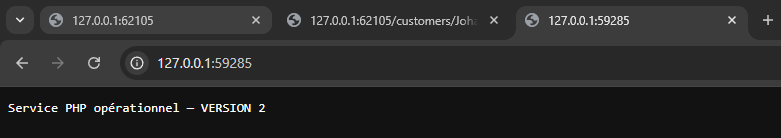

# Partie 5 : Création un déploiement et un service à l'aide d'un fichier YAML


## création des trois fichiers yml

phpservice-deployment.yml

phpservice-loadbalancing-service.yml

phpservice-service.yml

## Application du déploiement

```bash
kubectl apply -f phpservice-deployment.yml
```

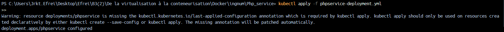


### vérification :

```bash
kubectl get deployments
```

```bash
kubectl get pods
```
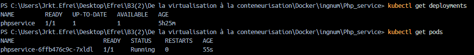


## Application du service NodePort

```bash
kubectl apply -f phpservice-service.yml
```

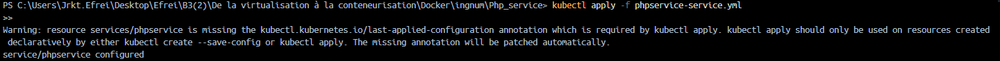


## Application du LoadBalancer

```bash
kubectl apply -f phpservice-loadbalancing-service.yml
```

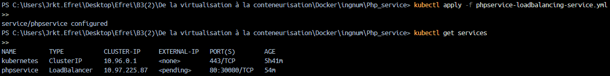


# TEST dans le navigateur 

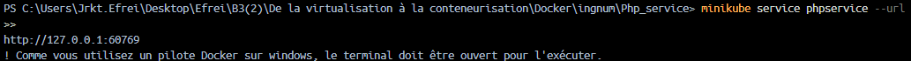


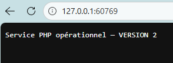


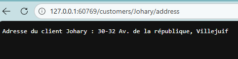


Mon GITHUB : https://github.com/Babajii91/docker_ingnum